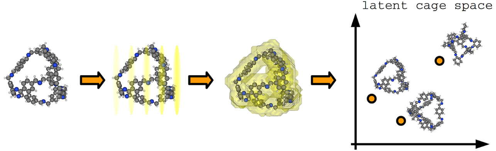
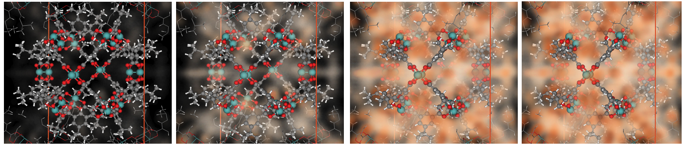
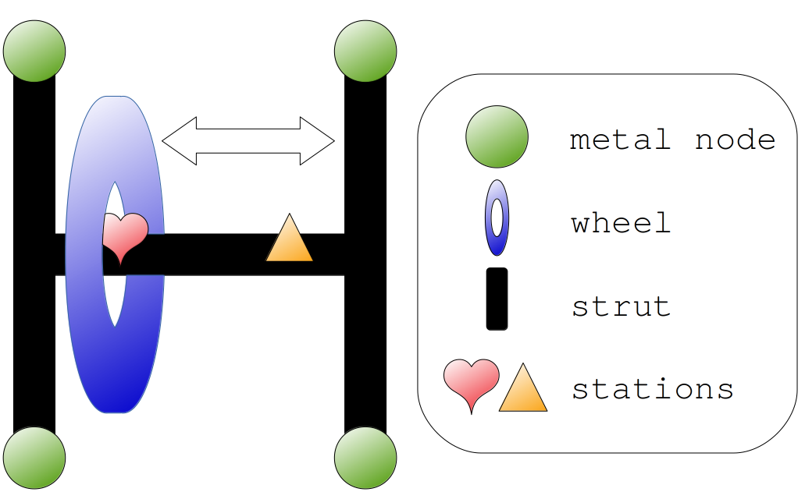

  School of Chemical, Biological, and Environmental Engineering 

We leverage machine learning, statistical mechanics, mathematical modeling, and molecular simulations to accelerate the discovery and deployment of nano-porous materials for gas storage, separations, and sensing. Our efforts directly contribute to the development of novel materials and technologies, the provision of cheaper and cleaner energy, and the enhancement of national security.

### metal-organic frameworks (MOFs)

Metal-organic frameworks (MOFs) are nano-porous, crystalline materials with large internal surface areas. 
For example, the interactive visualization below shows the crystal structure of the archetype MOF, IRMOF-1.

<iframe src="irmof-1.html" width="420px" height="420px" align="middle"></iframe>

Because gases selectively adsorb into their pores, MOFs have applications in:
* storing gases (e.g., storing natural gas compactly onboard a vehicle to be used as fuel)
* separating gases (e.g., capturing radioactive isotopes of noble gases that evolve into the air during the reprocessing of used nuclear fuel)
* detecting gases (e.g., detecting pollutants in outdoor air)

MOFs are synthesized modularly by combining organic linker molecules and inorganic nodes, which self-assemble in solution to form the porous framework. For example, IRMOF-1 is made from the inorganic node, Zn$_4$O, and organic linker molecule, benzene-1,4-dicarboxylic acid.

By changing these molecular building blocks, we can make many different MOFs with diverse pore geometries and internal surface chemistries, and, therefore, with diverse gas adsorption properties.

### machine learning for materials discovery

We use statistical machine learning to predict the adsorption properties of MOFs and automatically cluster together MOFs with similar structures.

<figure>
    

    
    

</figure>

### molecular modeling and simulation of gas adsorption in MOFs

In virtual high-throughput screenings, we 
build computer models of hypothetical MOF crystal structures that have never been made, then 
employ molecular models and simulations of gas adsorption to predict their adsorption properties. 
Our goals are to shortlist materials on which to focus experimental investigation and elucidate relationships between the structure of MOFs and their adsorption properties. 

We also use molecular models and simulations of gas adsorption to identify the most prominent gas adsorption sites in a material and understand how its structure gives rise to its adsorption properties.

<figure>
    

    
    

</figure>

We wrote (and currently maintain) our own software `PorousMaterials.jl` to simulate gas adsorption in MOFs.

### mathematical modeling of gas sensor arrays

In a gas sensor array, we monitor the adsorbed mass of gas in a set of diverse MOFs, $\mathbf{m}$. 
Changes in the gas composition, $\mathbf{p}$, cause changes in $\mathbf{m}$.
Therefore, we can infer the gas composition $\mathbf{p}$ by observing $\mathbf{m}$ (gas sensing!).

We develop mathematical models of gas sensor arrays to 
(i) parse the information-rich, high-dimensional response pattern of the sensor array and 
(ii) select the optimal combination of MOFs for gas sensor arrays. 

### statistical mechanical modeling of flexible, gas-responsive MOFs

We develop parsimonious but illuminating statistical mechanical models of gas adsorption in flexible/dynamic MOFs that can undergo structural changes upon the adsorption of gas. 
Our goal is to reveal insights into the adsorption properties of such MOFs and uncover any anomalous adsorption properties we could exploit for adsorption-based engineering applications.

<figure>
    

    
    

</figure>
