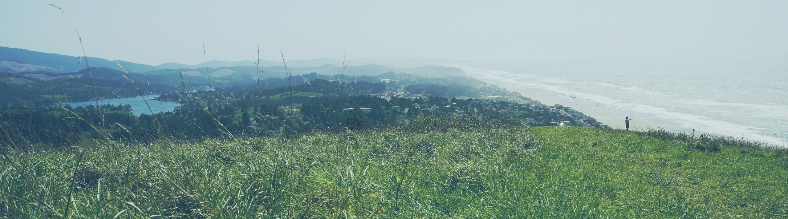

The application to the CBEE graduate program is [here](http://cbee.oregonstate.edu/che-graduate-program); mention your interest in working with us in your application.

# my advising style

We work *together* towards a common mission.

> If you want to build a ship, 
> don't drum up the people 
> to gather wood, divide the 
> work, and give orders. 
> Instead, teach them to yearn 
> for the vast and endless sea. 
> -- *Antoine de Saint-Exupéry*

# when you work on problems that interest you

> Suddenly knowing what's going on, with total certainty, *all the way to the bottom*-- is a special thing, attainable in few if any other places in life. You feel you're reached into the universe's guts and put your hand on the wire. It's hard to describe to people who haven't experienced it. -- *Jordan Ellenberg*

> Mainly play the things on the piano which please you, even if the teacher does not assign those. That is the way to learn the most, that when you are doing something with such enjoyment that you don't notice that the time passes. I am sometimes so wrapped up in my work that I forget about the noon meal. 
> -- *Albert Einstein*

# open source, reproducibility, and transparency
I am a proponent of free and open source software, data sharing, and fully reproducible research. Students can expect to use the Linux operating system (e.g., [Ubuntu](https://www.ubuntu.com/)) and learn free and open source programming languages [Python](https://www.python.org/) and [Julia](https://julialang.org/). We post our papers on ChemRxiv so they are freely available as preprints.

# our group is at a buffet

> I think you can put scientists into two buckets. One is the type who dives very deeply into one topic for their whole career and they know it better than anybody else in the world. Then there’s the other bucket, where I would put myself, where it’s like you’re at a buffet table and you see an interesting thing here and do it for a while, and that connects you to another interesting thing and you take a bit of that. That’s how I came to be working on CRISPR– it was a total side-project. -- *Jennifer Doudna*

Fortunately, our toolbox of mathematics, statistical mechanics, and machine learning enables us to approach a variety of interesting problems.

# Oregon is awesome

:evergreen_tree: Oregon is scenic and a great place for hiking, backpacking, camping, biking, rafting, etc. My own photos on [Ello](https://ello.co/cokes) and the Instagram [@outinoregon](https://www.instagram.com/outinoregon/) display some scenery you can encounter in Oregon.

:mountain: Mt. Bachelor near Bend and Mt. Hood near Portland offer world-class snowboarding/skiing.

:ocean: the scenic Oregon coast is just an hour-long drive from Corvallis.

:wine_glass: Corvallis is in the heart of Willamette Valley, known for its Pinot Noir wine. Countless wineries to go wine-tasting with views of vineyards.

:beer: There are several breweries in Corvallis. And an apple cidery.

:bicyclist: Corvallis is [bike-friendly](http://visitcorvallis.com/about-corvallis/corvallis-recognized-as-gold-level-bicycle-friendly-community/) for commuting to work (I bike to the office!) and offers many scenic biking trails.

:umbrella: Regarding [climate](https://en.wikipedia.org/wiki/Corvallis,_Oregon#Climate), temperatures are mild year-round in Corvallis. Rain keeps the scenery green and the air clean. The rainy season is romantic!

:house_with_garden: Enjoy the comforts of small town living in Corvallis: genuinely friendly folks, relatively affordable housing, little traffic, low crime rates, etc. 

:city_sunset: Live the city life on the weekends; Portland is my favorite city in the US and only a 1.5 hr drive from Corvallis.

:books: Corvallis is among America's most educated cities [[source](https://www.forbes.com/2008/02/07/americas-smartest-cities-oped-cx_apa_0207smartest_slide_6.html)].

:bus: We have free public transportation in Corvallis.

:moneybag: No sales tax in Oregon!

Also see [Why choose OSU?](http://admissions.oregonstate.edu/international/why-choose-osu).

# computational power

Our group contributed to the high-performance engineering cluster in the College of Engineering at Oregon State: (a) two nodes, each with 20 physical CPU cores and two NVIDIA GeForce GTX 1080 Ti GPUs and (b) four nodes, each with 44 cores. While we have priority running jobs on the computing resources we contributed, we have access to all 1,554 processor nodes on the high-performance computing cluster. A full-time staff manages these computing resources and serves as technical support. The PI and grad students each possess high-performance Linux workstations with GPU computing capabilities and two high-definition monitors to increase productivity.
