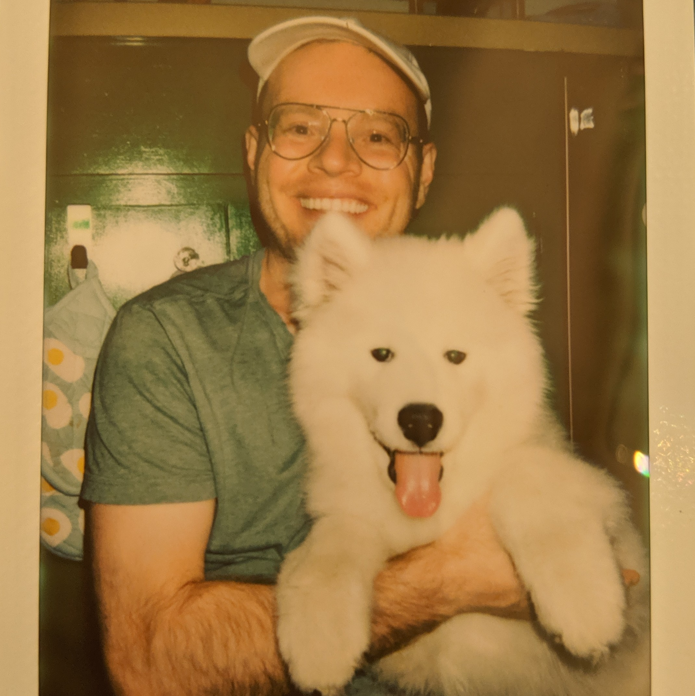

  School of Chemical, Biological, and Environmental Engineering 

# the professor

**Cory Simon** ([CV](CorySimon_academic_CV.pdf))  
Assistant Professor 
Ph.D. Chemical Engineering. University of California, Berkeley

Hails from a small town in Ohio. Learned the ropes of scientific research at the University of Akron, Virginia Tech, Okinawa Institute of Science and Technology, University of British Columbia, Lawrence Berkeley National Laboratory, École Polytechnique Fédérale de Lausanne, and Altius Institute for Biomedical Sciences. Interned in industry at Bridgestone Research (chemical engineering) and Stitch Fix (data science).

Lives with his girlfriend, Christina, near the research forest for long walks with his Samoyed, Oslo. Digs hiking/backpacking in scenic places (photos on <a href="https://ello.co/cokes">Ello</a>), snowboarding, and wine.

Cory.Simon [at] oregonstate.edu 
[@CoryMSimon](https://twitter.com/CoryMSimon?lang=en) 
Kelley Engineering Center 2045

# the grad students

### PhD students 



**{{ phd.name }}**. {{phd.degree }}

{{ phd.about }}

*research interests:* {{ phd.research }}



### MS students 



**{{ ms.name }}**. {{ms.degree }}

{{ ms.about }}

*research interests:* {{ ms.research }}



# the undergrad students



**{{ ugrad.name }}**. *{{ ugrad.major }}*.
{{ ugrad.about }}

*research interests:* {{ ugrad.research }}



# alumni

## graduate students


**{{ alum.name }}**. *{{ alum.major }}*. 
thesis: "{{ alum.thesis }}" 
<a href="{{ alum.gs }}">Google Scholar profile</a>.




## undergraduate students


**{{ alum.name }}**. major: *{{ alum.major }}*.
   now: {{ alum.now }}


