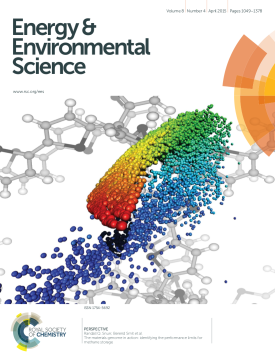
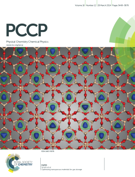
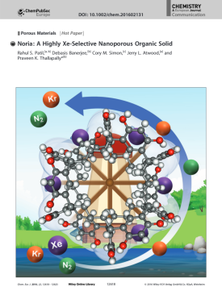

<!--

  

    
  

  

    
  

  

    
  

  

    
  

-->

    

<a href ="https://scholar.google.com/citations?user=eoR8MNMAAAAJ&hl=en`">Google Scholar</a>

# publications


  

 

        
 
            
        

    

    

        <b>{{ forloop.rindex }}.</b>
        <quotations>❝</quotations>{{ work.title }}<quotations>❞</quotations> 
        {{ work.authors }}. 
        <i>{{ work.journal }}</i>. ({{ work.date }}) <a href="{{ work.url }}">DOI</a>. {{ work.other }}
         
    

    

  

  


